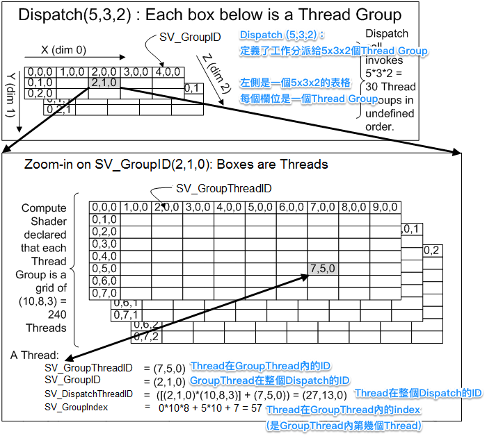
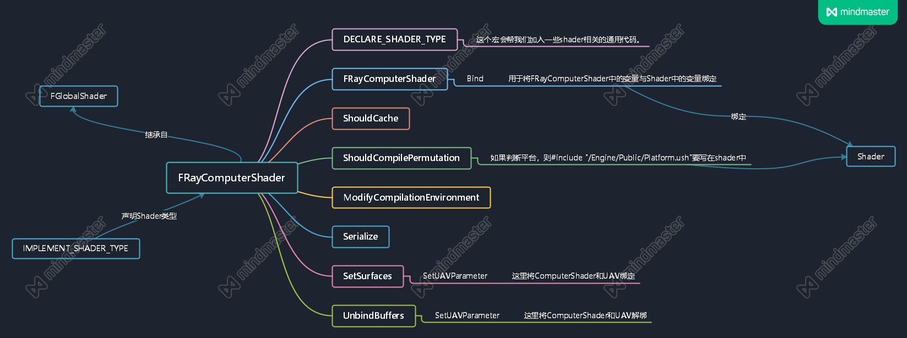

# 使用ComputeShader来输出计算结果

## shader代码分析
```cpp
#include "/Engine/Public/Platform.ush" //(1)
RWTexture2D<float4> OutputSurface;  //(2)

[numthreads(32, 32, 1)] //(3)
void MainCS(uint3 ThreadId : SV_DispatchThreadID) //(4)
{
    float sizeX, sizeY;
    OutputSurface.GetDimensions(sizeX, sizeY);
    float2 iResolution = float2(sizeX, sizeY);
    float2 uv = (ThreadId.xy / iResolution.xy); 
    
    OutputSurface[ThreadId.xy] = float4(uv, 0, 1);
}
```

* (1) 如果在ComputerShader的类内的成员函数ShouldCompilePermutation有判断平台则需要加这个include

* (2) 定义了一个Computer Shader要存取的贴图资源，可以在ComputerShader的类内进行绑定

* (3) 意思是创建了一个Thread Group，在执行时会把运算分派给每个Thread去执行。在这里表示一个Thread Group内有32 * 32 * 1 个Thread。

* (4) 这里声明了ThreadID表示SV_DispatchThreadID。具体什么是DispatchThreadID可以参考下图。简单来说就是DispatchThreadID是根据GroupID和GroupThreadID计算出来的某个线程在所有线程中的坐标



## FRayComputerShader代码分析
* 这个在Shader篇的ComputerShader中分析过了。这里用脑图简要分析一下ComputerShader的结构



## 渲染线程
```cpp
static void RayTracing_RenderThread(
	FRHICommandListImmediate& RHICmdList,
	ERHIFeatureLevel::Type FeatureLevel
)
{
	check(IsInRenderingThread());
	TArray<FVector4> Bitmap;

    // --- (1) begin ---
	TShaderMapRef<FRayComputerShader>ComputerShader(GetGlobalShaderMap(FeatureLevel)); 
	RHICmdList.SetComputeShader(ComputerShader->GetComputeShader()); 
    // --- (1) end ---

	int32 SizeX = 256;
	int32 SizeY = 256;

	FRHIResourceCreateInfo CreateInfo;
	FTexture2DRHIRef Texture = RHICreateTexture2D(SizeX, SizeY, PF_A32B32G32R32F, 1, 1, TexCreate_ShaderResource | TexCreate_UAV, CreateInfo); //(2)
	FUnorderedAccessViewRHIRef TextureUAV = RHICreateUnorderedAccessView(Texture);
	ComputerShader->SetSurfaces(RHICmdList, TextureUAV); //(3)
	DispatchComputeShader(RHICmdList, *ComputerShader, SizeX / 32, SizeY / 32, 1); //(4)
	ComputerShader->UnbindBuffers(RHICmdList);

	Bitmap.Init(FVector4(1.f, 0.f, 0.f, 1.f), SizeX * SizeY);

	uint32 LolStride = 0;
	uint8* TextureDataPtr = (uint8*)RHICmdList.LockTexture2D(Texture, 0, EResourceLockMode::RLM_ReadOnly, LolStride, false);
	uint8* ArraryData = (uint8*)Bitmap.GetData();
	FMemory::Memcpy(ArraryData, TextureDataPtr, GPixelFormats[PF_A32B32G32R32F].BlockBytes * SizeX * SizeY);
	RHICmdList.UnlockTexture2D(Texture, 0, false);

	SaveArrayToTexture(&Bitmap, SizeX, SizeY);
}
```
* (1) ComputerShader的创建以及将其设置为当前的ComputerShader

* (2) 创建一个2D纹理，大小是SizeX * SizeY ,格式是ABGR,且每位为32位float数, TexCreate_ShaderResource 是纹理可以用作着色器资源,TexCreate_UAV是纹理可以用作UAV资源
> [UAV](https://docs.microsoft.com/zh-cn/windows/win32/direct3d12/typed-unordered-access-view-loads):UAV事实上是一个可以多线程随机读写的缓冲区

* (3) 将UAV视图和ComputerShader绑定,这样OutputSurface的计算结果存储到了UAV的缓冲区

* (4) DispatchComputeShader的操作是用来划分Thread Group,这里相当于创建了 8 * 8 * 1的线程组，在shader代码里[numthreads(32, 32, 1)]相当于每个线程组里有32 * 32 * 1个线程。这里应该同时也运行了Shader